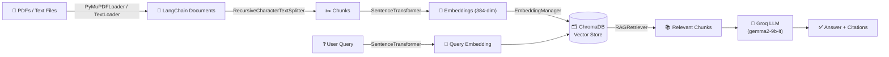

<div align="center">

# 📚 LangChain Learning RAG

**A from-scratch Retrieval-Augmented Generation pipeline — PDFs in, grounded answers out.**

No black-box `VectorStore` wrappers, no hidden chains — every stage of the RAG pipeline
(loading, chunking, embedding, storing, retrieving, generating) is written out by hand so you
can actually see how it works.


</div>

---

## ✨ What's inside

- 📄 **Multi-format ingestion** — plain text, directories, and PDFs (via `PyMuPDFLoader`)
- ✂️ **Recursive chunking** with configurable size/overlap for embedding-friendly windows
- 🧠 **Local embeddings** using `sentence-transformers` (`all-MiniLM-L6-v2`, 384-dim) — no API calls needed to embed
- 🗂️ **Persistent vector storage** in ChromaDB, with rich per-chunk metadata
- 🔍 **Cosine-similarity retrieval** with score thresholding and top-k control
- ⚡ **Groq-powered generation** (`gemma2-9b-it`) for fast, free-tier-friendly LLM responses
- 🚀 **Three progressively richer RAG flavors**: a bare-bones function → a version with sources & confidence scores → a full pipeline with streaming, citations, and query history

## 🏗️ Architecture



## 📁 Project structure

```
langchainLearningRag/
├── data/
│   ├── pdf/              # Source PDFs to ingest
│   ├── text_files/       # Sample .txt files
│   └── vector_store/     # Persisted ChromaDB collection (generated, git-ignored)
├── notebook/
│   ├── document.ipynb    # Loader fundamentals: Document objects, TextLoader, DirectoryLoader, PyMuPDFLoader
│   └── pdf_loader.ipynb  # The full pipeline: ingest → chunk → embed → store → retrieve → generate
├── main.py
├── pyproject.toml
├── requirements.txt
└── .env.example
```

## 🚀 Getting started

### Prerequisites
- Python 3.11+
- [`uv`](https://docs.astral.sh/uv/) (recommended) or `pip`
- A free [Groq](https://console.groq.com) API key for the generation step

### Install

```bash
git clone https://github.com/aryankarn/langchainlearningrag.git
cd langchainlearningrag

# with uv (recommended)
uv sync

# or with pip
pip install -r requirements.txt
```

### Configure

```bash
cp .env.example .env
# then open .env and paste your GROQ_API_KEY
```

### Run

Open either notebook in Jupyter / VS Code and run cells top to bottom:

```bash
jupyter lab notebook/pdf_loader.ipynb
```

- Start with **`document.ipynb`** to see how each LangChain loader works in isolation.
- Then run **`pdf_loader.ipynb`** for the end-to-end RAG pipeline — it'll ingest the PDFs in
  `data/pdf`, build the vector store, and let you query it through Groq.

## 🧰 Tech stack

| Layer | Tool |
|---|---|
| Orchestration | [LangChain](https://www.langchain.com/) v1 (`langchain-core`, `langchain-text-splitters`) |
| PDF parsing | `PyMuPDF` via `langchain-community` |
| Embeddings | `sentence-transformers` (`all-MiniLM-L6-v2`) |
| Vector store | [ChromaDB](https://www.trychroma.com/) (persistent, local) |
| LLM inference | [Groq](https://groq.com/) (`gemma2-9b-it`) via `langchain-groq` |
| Package management | [`uv`](https://docs.astral.sh/uv/) |

## 🗺️ Roadmap

- [ ] Wire up `faiss-cpu` as an alternative vector store for comparison
- [ ] Swap in real streaming responses from Groq instead of the simulated typewriter effect
- [ ] Add automated evaluation (retrieval precision/recall on a labeled query set)

---

<div align="center">

Built as a hands-on learning project for understanding RAG pipelines end-to-end.

</div>
